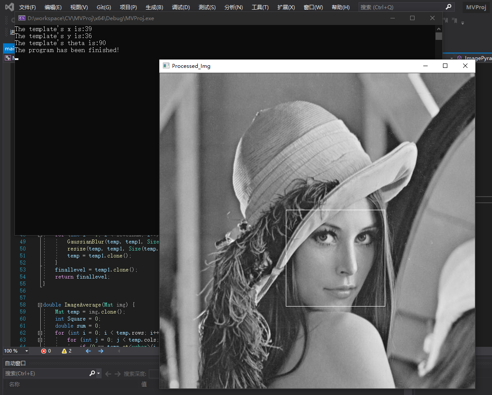

# Machine Version Template Matching

## Introduction

This project is my machine vision class’s homework.

First, It uses Image Pyramid Algorithm to change the picture and template size. Then, use template matching algorithm to match the picture and template. Finally, in the origin picture, I will mark the position of the template.

## Environment

Windows 10, Visual Studio 2019, OpenCV 4.5.1.

## Installation

You can install OpenCV 4.5.1 through this [website](https://opencv.org/);

Attention: You also need to config your VS project setting, otherwise, you can’t use OpenCV in your project.

## Usage

The program effect is as follows:

The origin picture:

The template picture:

The result (the origin picture has changed into the grey picture):

# Maintainers

[@mookie1702](https://github.com/mookie1702)

# License

[MIT](https://opensource.org/licenses/MIT)

